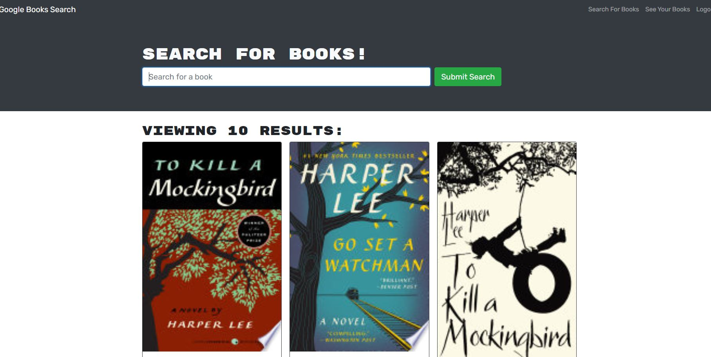
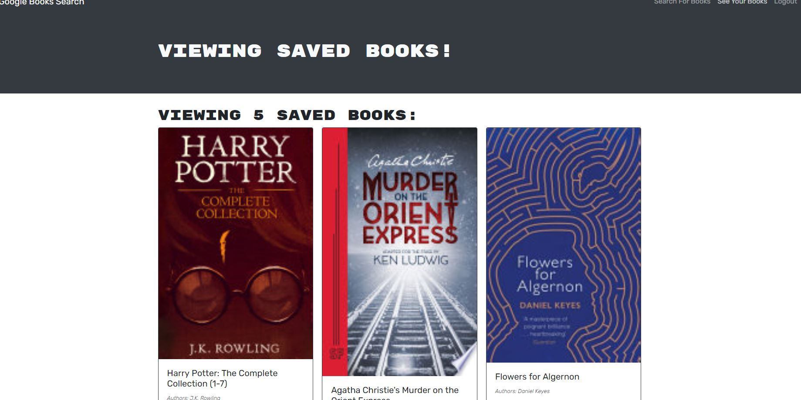

# Google Book Search

  

  ## Description 
  
  Google Book Search is an application that uses a google api to search for books. If a user is logged into an account not only can they search for book titles on the app but they can save them to their account. This can allow a user to accumulate a list of books that they are interested in reading. Once the user has decided that they want to remove a title from their collection they can do so with the click of a button. This was a refactoring project, as the application already existed as a RESTful API. The goal was to convert it into a GraphQl API built with Apollo Server.

    ## Images
  
  
  
  
  ## Table of Contents
  
  * [Installation](#installation)
  * [Usage](#usage)
  * [Credits](#credits)
  * [License](#license)
  

  ## Installation
  
  No installation for the project is required. To see the end result visit https://powerful-hamlet-89920.herokuapp.com/
  
  ## Usage 

  Visit the website. Create an account. Search for books and add/remove them from your list. It's as simple as that.
  
  ## Credits
  
  n/a
   
  ## License

  Apache
  
  
  ## Questions
  If you run into any errors or have further questions about this program, you can contact here: 

  *github: https://github.com/parkerrobison 

  *email: parkerobison@gmail.com.
  
  Please reference the project in question in the message. Thank you.
